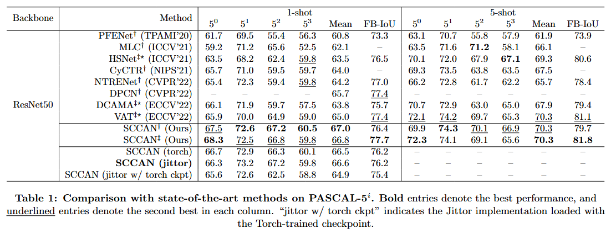
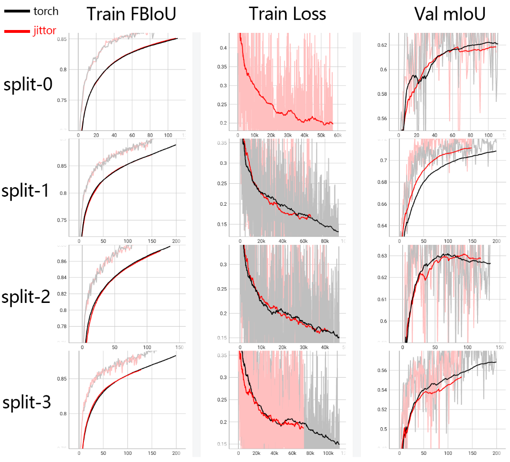

# SCCAN: 基于Jittor框架的实现


本实现基于论文[《Self-Correlation and Cross-Correlation Attention Network for Few-Shot Semantic Segmentation》](https://arxiv.org/abs/2308.09294)，使用 Jittor 框架进行复现。

## 环境配置

通过 conda 创建环境:
```bash 
conda env create -f environment.yml
```

1. 如果 jittor 环境报错:
```bash
ImportError: ~/anaconda3/envs/sccan_jittor/bin/../lib/libstdc++.so.6: version `GLIBCXX_3.4.30' not found (required by ~/.cache/jittor/jt1.3.9/g++11.4.0/py3.7.16/Linux-5.15.0-1xe3/IntelRXeonRGolx62/6c05/default/cu12.2.140_sm_89/jittor_core.cpython-37m-x86_64-linux-gnu.so)
```

可以尝试使用系统库: 
```bash
cp /usr/lib/x86_64-linux-gnu/libstdc++.so.6 /path/to/your/jittor/env/lib/
rm -rf ~/.cache/jittor/
```

2. 如果 jittor 环境报错:
```bash
RuntimeError: MD5 mismatch between the server and the downloaded file ~/.cache/jittor/cutlass/cutlass.zip terminate called without an active exception
```

可以手动下载并移动到对应位置: 
```bash
wget https://cg.cs.tsinghua.edu.cn/jittor/assets/cutlass.zip
```


## 准备数据
本项目使用 PASCAL-5<sup>i</sup> 和 COCO-20<sup>i</sup> 数据集进行训练和测试。

### 下载数据集
- PASCAL-5<sup>i</sup>:  [VOC2012](http://host.robots.ox.ac.uk/pascal/VOC/voc2012/) + [SBD](http://home.bharathh.info/pubs/codes/SBD/download.html)
- COCO-20<sup>i</sup>:  [COCO2014](https://cocodataset.org/#download)

数据目录结构为:

```
../
├── SCCAN-jittor/
└── data/
    ├── VOCdevkit2012/
    │   └── VOC2012/
    │       ├── JPEGImages/
    │       ├── ...
    │       └── SegmentationClassAug/
    └── MSCOCO2014/           
        ├── annotations/
        │   ├── train2014/ 
        │   └── val2014/
        ├── train2014/
        └── val2014/
```

#### Pascal
运行下面的脚本下载 Pascal 数据集
```bash
bash scripts/download_pascal.sh
```
然后下载预处理后的标签掩码 [SegmentationClassAug](https://etsmtl365-my.sharepoint.com/:u:/g/personal/seyed-mohammadsina_hajimiri_1_ens_etsmtl_ca/Ef70aWKWEidJoR_NZb131SwB3t7WIHMjJK316qxIu_SPyw?e=CVtNKY), 解压在 `data/VOCdevkit2012/VOC2012/SegmentationClassAug/`

#### COCO
```bash
bash scripts/download_coco.sh
```

## 准备模型训练权重

- 下载预训练的骨干模型权重 [ResNet-50](https://entuedu-my.sharepoint.com/:u:/g/personal/qianxion001_e_ntu_edu_sg/EbntykE8vXFMotK31vYk8iABRhFwvgVDt93koaIA63YgJQ?e=rE0swx) 并放置在 `initmodel` 目录下
- 下载实验训练权重: ([百度网盘](https://pan.baidu.com/s/1uxvcmPPwDPnN2MPlwEMzwg?pwd=1234) 提取码: 1234) 并放置在 `exp` 目录下, 结构如下:
```
SCCAN-jittor/
└── exp
    └── pascal
        └── SCCAN
            ├── split0_1shot
            ├── split1_1shot
            ├── split2_1shot
            └── split3_1shot
```


## 训练

### 训练命令
使用以下命令进行训练：
```bash
bash train.sh <device_id> <split> <shot>
```
- device_id: GPU ID
- split: 0-3, 数据集划分
- shot: [1|5], 支持样本数量

例如使用 GPU 0 在 PASCAL-5<sup>0</sup> 上进行 1-shot 训练：
```bash
bash train.sh 0 0 1
```

## 测试

### 测试命令
使用以下命令进行测试：
```bash
bash test.sh <device_id> <split> <shot> <ckpt_type>
```
- device_id: GPU ID
- split: 0-3, 数据集划分
- shot: [1|5], 支持样本数量
- ckpt_type: [torch | jittor], 如果 ckpt_type 为 torch，则使用 torch 预训练的权重，否则使用 Jittor 训练的权重

例如使用 GPU 0 在 PASCAL-5<sup>0</sup> 上进行 1-shot 测试，使用 Jittor 训练的权重：
```bashj
bash test.sh 0 0 1 jittor
```
或者使用 jittor 框架验证 torch 训练的权重：
```bash
bash test.sh 0 0 1 torch
```

## 实验

### 结果对比
- 目前只在 Pascal-5<sup>0</sup> 1-shot 上进行



### 曲线对比
- 黑色为 torch 复现实验结果
- 红色为 jittor 复现实验结果


### 实验日志
位于 `logs/` 目录下，每个训练任务对应一个日志文件，包含：
- jittor 框架训练/测试的日志  
- jittor 框架使用 torch 训练的权重进行测试的日志  

tensorboard 实验日志可从**准备模型预训练权重**-实验训练权重中获取